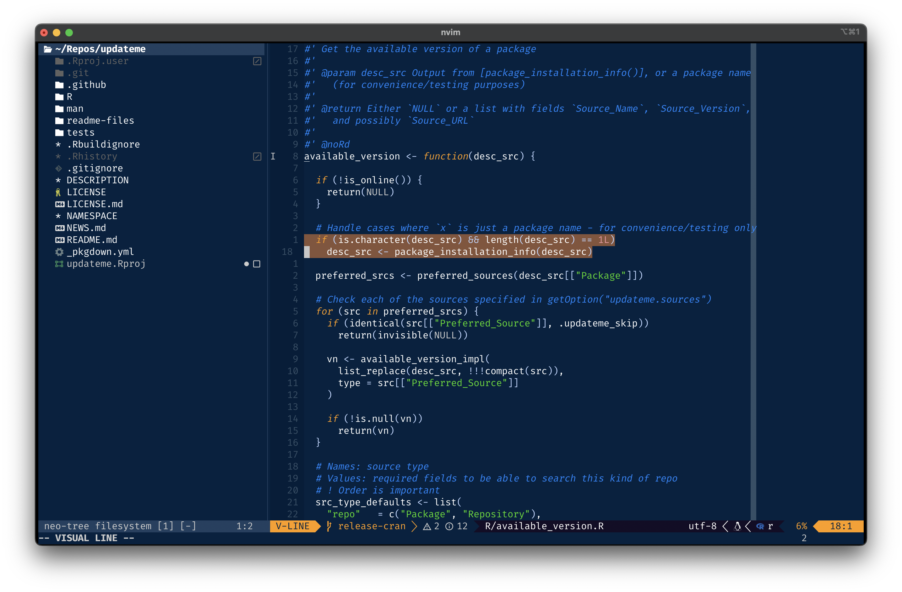

<p align="center">
  <h2 align="center">cobalt.nvim</h2>
</p>

This is a **work in progress** port of the classic blue theme from TextMate. 
There are many great themes for Neovim out there, but I've not yet found
one as easy on the eyes as this.



## Features

- Extensive support for `TreeSitter` syntax highlighting, and _many_ popular plugins
- Compilation to lua byte code for super fast startup times

## Installation/usage:

Download with your favorite package manager:

#### lazy.nvim:
```lua
 {
     "wurli/cobalt.nvim",
     config = function()
         vim.cmd[[colorscheme cobalt]]
     end
 }
```

## Configuration

There is no need to call setup if you are ok with the defaults.

```lua
-- Default options:
require('cobalt').setup({
    compile = false,              -- enable compiling the colorscheme
    undercurl = true,             -- enable undercurls
    commentStyle = { italic = true },
    functionStyle = {},
    keywordStyle = { italic = true},
    statementStyle = { bold = true },
    typeStyle = {},
    transparent = false,          -- do not set background color
    dimInactive = false,          -- dim inactive window `:h hl-NormalNC`
    terminalColors = true,        -- define vim.g.terminal_color_{0,17}
    colors = {                    -- add/modify theme and palette colors
        palette = {},
        theme = { default = {} }, -- Default is the only theme for now
    },
    overrides = function(colors)  -- add/modify highlights
        return {}
    end,
    theme = "classic",            -- Load "wave" theme when 'background' option is not set
    background = {                -- map the value of 'background' option to a theme
        dark = "classic",         -- try "dragon" !
        light = "lotus",
    },
})

-- setup must be called before loading
vim.cmd("colorscheme cobalt")
```

**_NOTE 1:_** If you enable compilation, make sure to run `:CobaltCompile` command every time you make changes to your config.

```vim
" 1. Modify your config
" 2. Restart nvim
" 3. Run this command:
:CobaltCompile
```

**_NOTE 2:_** Cobalt adjusts to the value of some options. Make sure that the options `'laststatus'` and `'cmdheight'` are set **_before_** calling `setup`.

## Customization

 In cobalt, there are _two_ kinds of colors: `PaletteColors` and `ThemeColors`; 
 `PaletteColors` are defined directly as RGB Hex strings, and have arbitrary names 
 that recall their actual color. Conversely, `ThemeColors` are named and grouped _semantically_ 
 on the basis of their actual function. 

 In short, a `palette` defines all the available colors, while a `theme` maps the `PaletteColors` 
 to specific `ThemeColors` and the same palette color may be assigned to multiple theme colors. 

 You can change _both_ theme or palette colors using `config.colors`. 
 All the palette color names can be found [here](lua/cobalt/colors.lua), 
 while their usage by each theme can be found [here](lua/cobalt/themes.lua). 

 ```lua 
 require('cobalt').setup({ 
     ..., 
     colors = { 
         palette = { 
             -- change all usages of these colors 
             MintyFresh = "#3AD900", -- string
             SereneSky  = "#0088FF", -- comment
         }, 
         theme = { 
             -- change specific usages for a certain theme, or for all of them 
             default = { 
                 ui = { 
                     float = { 
                         bg = "none", 
                     }, 
                 }, 
             }, 
         } 
     }, 
     ... 
 }) 
 ``` 

You can conveniently add/modify `hlgroups` using the `config.overrides` option.
Supported keywords are the same for `:h nvim_set_hl` `{val}` parameter.

```lua
require('cobalt').setup({
    ...,
    overrides = function(colors)
        return {
            -- Assign a static color to strings
            String = { fg = colors.palette.PaleBlue, italic = true },
            -- theme colors will update dynamically when you change theme!
            SomePluginHl = { fg = colors.theme.syn.type, bold = true },
        }
    end,
    ...
})
```


#### Transparent Floating Windows

This will make floating windows look nicer with default borders.

```lua
overrides = function(colors)
    local theme = colors.theme
    return {
        NormalFloat = { bg = "none" },
        FloatBorder = { bg = "none" },
        FloatTitle = { bg = "none" },

        -- Save an hlgroup with dark background and dimmed foreground
        -- so that you can use it where your still want darker windows.
        -- E.g.: autocmd TermOpen * setlocal winhighlight=Normal:NormalDark
        NormalDark = { fg = theme.ui.fg_dim, bg = theme.ui.bg_m3 },

        -- Popular plugins that open floats will link to NormalFloat by default;
        -- set their background accordingly if you wish to keep them dark and borderless
        LazyNormal = { bg = theme.ui.bg_m3, fg = theme.ui.fg_dim },
        MasonNormal = { bg = theme.ui.bg_m3, fg = theme.ui.fg_dim },
    }
end,
```

If you'd like to keep the floating windows darker, but you're unhappy with how
borders are rendered, consider using characters that are drawn at the edges of
the box:

```lua
{ "🭽", "▔", "🭾", "▕", "🭿", "▁", "🭼", "▏" }
```

#### Borderless Telescope

Block-like _modern_ Telescope UI

```lua
overrides = function(colors)
    local theme = colors.theme
    return {
        TelescopeTitle = { fg = theme.ui.special, bold = true },
        TelescopePromptNormal = { bg = theme.ui.bg_m2 },
        TelescopePromptBorder = { fg = theme.ui.bg_m2, bg = theme.ui.bg_m2 },
        TelescopeResultsNormal = { fg = theme.ui.fg, bg = theme.ui.bg_m1 },
        TelescopeResultsBorder = { fg = theme.ui.bg_m1, bg = theme.ui.bg_m1 },
        TelescopePreviewNormal = { bg = theme.ui.bg_p2 },
        TelescopePreviewBorder = { bg = theme.ui.bg_p2, fg = theme.ui.bg_p2 },
    }
end,
```

#### Dark completion (popup) menu

More uniform colors for the popup menu.

```lua
overrides = function(colors)
    local theme = colors.theme
    return {
        Pmenu = { fg = theme.ui.shade0, bg = theme.ui.bg_p1 },  -- add `blend = vim.o.pumblend` to enable transparency
        PmenuSel = { fg = "NONE", bg = theme.ui.bg_p2 },
        PmenuSbar = { bg = theme.ui.bg_m1 },
        PmenuThumb = { bg = theme.ui.bg_p2 },
    }
end,
```

## Acknowledgements

The implementation of this plugin is based on the [Kanagawa](https://github.com/rebelot/kanagawa.nvim)
theme by [Tommaso Laurenzi](https://github.com/rebelot).

- [Kanagawa](https://github.com/rebelot/kanagawa.nvim)
- [Tokyonight](https://github.com/folke/tokyonight.nvim)
- [Gruvbox](https://github.com/morhetz/gruvbox)
- [Catppuccin](https://github.com/catppuccin/nvim)
- [Affinity Designer](https://affinity.serif.com/designer/)

